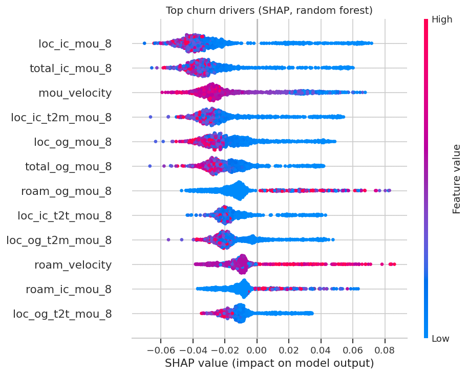
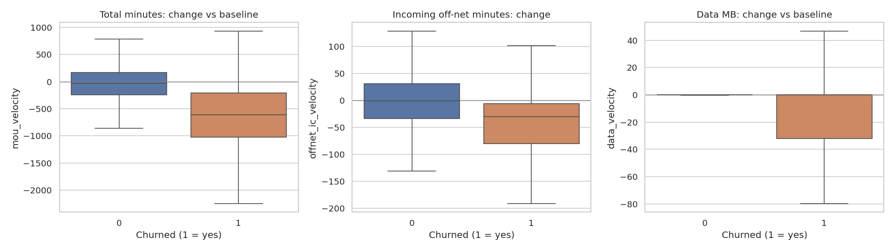

# Telecom Customer Churn Prediction: High-Value Subscriber Retention

Predicts which high-value prepaid subscribers will churn next month, explains why, and shows whether a targeted retention campaign pays for itself.

**Stack:** Python (pandas, NumPy, scikit-learn, SHAP, Matplotlib, Seaborn), SQL (DuckDB), Jupyter

**Author:** Samarjit Kabadi ([LinkedIn](https://www.linkedin.com/in/samarjith-kabadi)).

---

## Headline results (untouched hold-out test set, 6,003 customers)

| Metric | Result | What it means |
| :--- | :--- | :--- |
| **Recall** | **83%** | 83 of every 100 real churners are flagged before they leave |
| **Precision** | **45.5%** | Almost half of flagged customers really churn, **5.3x** better than random targeting (8.6%) |
| **F2-score** | **0.71** | Strong result when missing a churner costs more than a wasted offer |
| **ROC-AUC / PR-AUC** | **0.94 / 0.69** | Ranking quality across all thresholds |
| **Top-decile capture** | **69%** | The riskiest 10% of customers contain 69% of all churners |
| **Campaign value** | **+INR 89k vs −INR 615k** | Model-targeted campaign is profitable; contacting every high-value customer loses money (see assumptions below) |

The test set was not used for training, model selection or threshold selection, so these figures are an honest estimate of performance on new customers.

---

## Business context

* **Prepaid churn is silent.** Customers do not cancel; they stop using the service. Churn is therefore defined by usage: zero incoming calls, zero outgoing calls and zero mobile data in the churn month.
* **Focus on high-value customers (HVC).** Customers whose average recharge in the first two months is at or above the **70th percentile (the top 30%)**, INR 368+. This leaves **30,011** customers, who generate **~63% of total ARPU**, with an **8.6%** churn rate.
* **Three-phase customer lifecycle**
  * **Good phase** (months 6–7): baseline behaviour
  * **Action phase** (month 8): behaviour starts to change; this is when the business can still intervene
  * **Churn phase** (month 9): used only to create the target, then removed to prevent leakage

## Data

99,999 subscribers x 226 columns from a telecom operator covering June–September: minutes of use (MOU) by call type, 2G/3G data volume, recharges, ARPU and service flags. See the data dictionary in this repo.

---

## Method

### 1. Cleaning and feature engineering
* Missing usage treated as no activity; unused service flags set to -1; constant columns dropped.
* **Recency:** days since the last recharge and last data recharge at the end of the action phase.
* **Velocity features:** action-phase usage minus good-phase average, for total minutes, incoming minutes, incoming off-network minutes, data volume and roaming.
* **Usage-only model (design decision):** recharge amount and ARPU columns are excluded from the features, because in month 8 they largely restate the outcome (a leaving customer stops recharging). This gives an earlier, behavioural warning signal. The cost of this choice was measured: including revenue features lifts validation PR-AUC only from 0.66 to 0.70 (gradient boosting). ARPU is kept aside to value the campaign.

### 2. Leak-free evaluation
* **60 / 20 / 20 stratified split:** train, validation (model choice and threshold), test (reported once).
* **scikit-learn Pipelines:** outlier capping (99th percentile), scaling and PCA are fitted on training data only.

### 3. Model comparison (validation set)

| Model | PR-AUC | ROC-AUC |
| :--- | :---: | :---: |
| **Random forest (selected)** | **0.68** | **0.92** |
| Gradient boosting | 0.66 | 0.92 |
| Lasso (L1) logistic regression | 0.47 | 0.89 |
| Logistic regression + PCA (baseline) | 0.47 | 0.89 |

PR-AUC is used instead of accuracy because of the 91 / 9 class imbalance. A model that predicts "no churn" for everyone would already be ~91% accurate.

### 4. Threshold selection
The alert threshold (**0.24**) maximises the **F2-score** on the validation set, weighting recall twice as heavily as precision because losing a high-value customer costs more than an unnecessary offer.

---

## What drives churn (SHAP)



* **Falling incoming calls in month 8** is the strongest signal. When fewer people call a customer, that customer has usually started giving out a different number.
* **Overall usage collapse** (`mou_velocity`): churners' minutes drop by a median of ~600 versus their baseline, compared with ~30 for customers who stay.
* **Rising roaming in month 8** increases churn risk, consistent with customers moving away from their home circle.
* **Drop in incoming off-network calls**: contacts on other networks stop reaching the customer on this number.



---

## Business case: does a retention campaign pay?

Assumptions (editable in Section 9 of the notebook): **INR 150** offer per contacted customer, **30%** of contacted churners retained, **3 months** of ARPU kept per saved customer.

| Strategy (6,003 test customers) | Contacted | Churners reached | Revenue saved | Offer cost | Net value |
| :--- | ---: | ---: | ---: | ---: | ---: |
| Contact every HVC | 6,003 | 519 | INR 285k | INR 900k | **−INR 615k** |
| **Model-targeted** | **948** | **431** | **INR 231k** | **INR 142k** | **+INR 89k** |

Targeting with the model contacts **84% fewer customers** while still reaching **83% of churners**. The notebook includes a sensitivity table across save rates and offer costs.

---

## SQL reporting layer

The scored test customers are exported to `outputs/risk_scores.csv` (anonymised IDs) and queried with DuckDB. The queries in `sql/` answer the questions a retention team would ask:

| Query | Question answered |
| :--- | :--- |
| `01_revenue_at_risk_by_tier.sql` | How many customers and how much ARPU sit in each risk tier? |
| `02_decile_lift.sql` | How concentrated are churners among the highest scores? (decile lift) |
| `03_priority_call_list.sql` | Which flagged customers should be called first, by expected ARPU at risk? |

Risk tiers: **High** (probability ≥ 0.5) 495 customers with a 65% churn rate; **Medium** (0.24–0.5) 453 customers with a 24% churn rate; **Low** 5,055 customers with a 1.7% churn rate.

The same CSV can be loaded into Power BI to build a retention dashboard.

---

## Repository structure

```
Telecom_HVC_Churn_Model.ipynb   Full analysis, runs top to bottom
telecom_churn_data.csv.zip      Raw data (read directly by the notebook)
Data+Dictionary-...xlsx         Column definitions
sql/                            DuckDB queries for the reporting layer
outputs/risk_scores.csv         Scored hold-out customers
images/                         Charts used in this README
churn_analysis.pptx             Stakeholder strategy brief
requirements.txt                Python dependencies
```

## How to run

```bash
pip install -r requirements.txt
jupyter notebook Telecom_HVC_Churn_Model.ipynb
```

## Limitations and next steps

* The cost–benefit figures depend on assumed offer cost and save rate. They should be replaced with results from a real A/B-tested retention offer.
* Four months of data from a single operator; performance should be re-checked on newer periods to catch data drift.
* Next steps: tune hyperparameters with cross-validation, calibrate probabilities, and build a Power BI retention dashboard on the risk scores.
